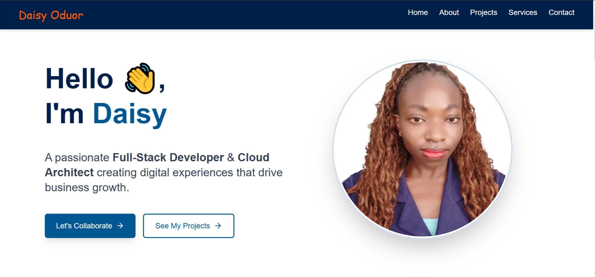

# My Professional Portfolio

 

A modern, responsive portfolio website built with Next.js, TypeScript, and Tailwind CSS to showcase my skills, projects, and professional journey.

## 🌟 Features

- **Modern UI**: Clean, professional design with smooth animations
- **Fully Responsive**: Works perfectly on all devices
- **Project Showcase**: Highlight your best work with details
- **Contact Form**: Integrated with FormSubmit for easy communication
- **Performance Optimized**: Fast loading with Next.js optimizations


## 🛠 Technologies Used

- **Frontend**: 
  - Next.js 14 (App Router)
  - TypeScript
  - Tailwind CSS
  - React Icons (Lucide)
- **Form Handling**: FormSubmit.co
- **Deployment**: Vercel

## 🚀 Getting Started

### Prerequisites
- Node.js (v18 or later)
- npm or yarn

### Installation
1. Clone the repository:
   ```bash
   git clone https://github.com/yourusername/portfolio.git
